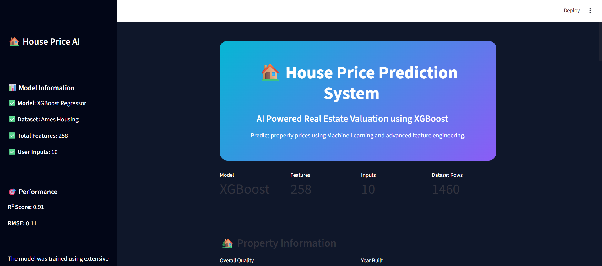
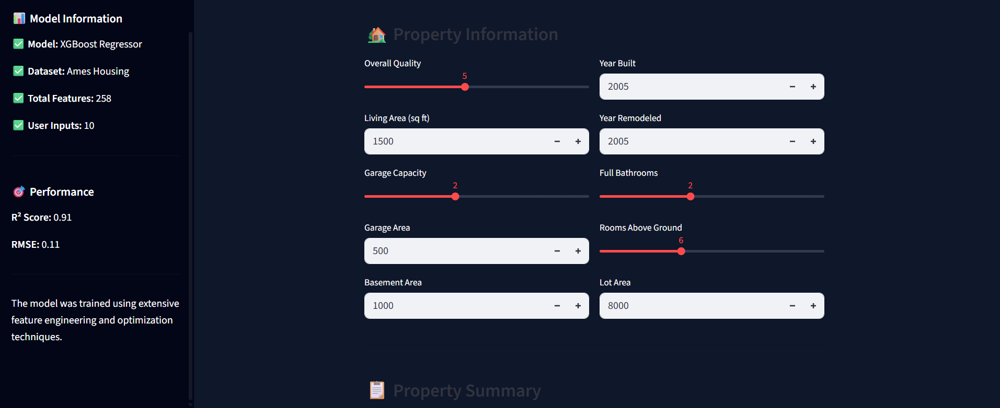
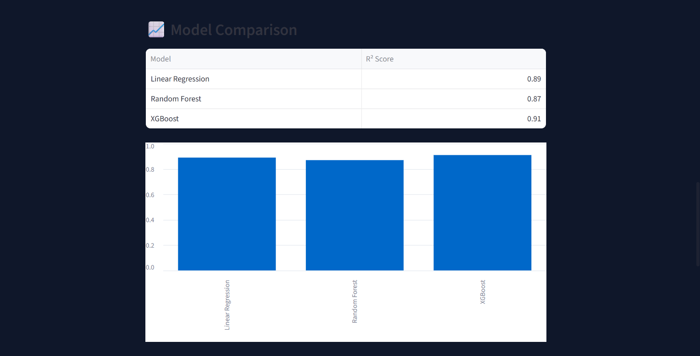

# 🏠 House Price Prediction using Machine Learning
<p align="center">
  
</p>

---

## 📌 Project Overview

House Price Prediction is a Machine Learning project that predicts the selling price of residential properties using the Ames Housing Dataset.

The project follows a complete Machine Learning pipeline, including:

* Data Cleaning
* Missing Value Handling
* Exploratory Data Analysis (EDA)
* Feature Engineering
* Feature Encoding
* Model Training
* Model Evaluation
* Model Deployment using Streamlit

The final deployed model uses  **XGBoost Regressor** , which achieved the best performance among all tested models.

---

## 🎯 Objective

The objective of this project is to accurately predict house prices based on various property characteristics such as:

* Living Area
* Overall Quality
* Garage Capacity
* Basement Features
* Property Age
* Location Information
* Outdoor Features

---

## 📊 Dataset Used

**House Prices: Advanced Regression Techniques (Kaggle Competition Dataset)**

The project is built using the Ames Housing Dataset and focuses on predicting residential property prices through machine learning techniques and feature engineering.

### Dataset Statistics

| Attribute            | Value      |
| -------------------- | ---------- |
| Total Records        | 1460       |
| Total Features       | 81         |
| Numerical Features   | 36         |
| Categorical Features | 43         |
| Target Variable      | SalePrice  |
| Problem Type         | Regression |

---

## 🧹 Data Preprocessing

The following preprocessing steps were performed:

### Missing Value Handling

* Filled absence-based categorical features with `"None"`
* Filled absence-based numerical features with `0`
* Median imputation for numerical features
* Mode imputation for categorical features

### Log Transformation

The target variable (`SalePrice`) was log-transformed using `log1p()` to reduce skewness and improve model performance.

### Outlier Removal

Extreme outliers were identified and removed to improve model generalization and prediction accuracy.

---

## 📈 Exploratory Data Analysis (EDA)

Several exploratory analyses were performed to better understand the dataset:

* SalePrice Distribution Analysis
* Log Transformation Analysis
* Correlation Analysis
* Feature Relationship Analysis
* Outlier Detection
* Feature Distribution Analysis

### Key Insights

The most influential features affecting house prices were:

* OverallQual
* GrLivArea
* GarageCars
* GarageArea
* TotalBsmtSF
* 1stFlrSF
* FullBath
* YearBuilt

---

## ⚙️ Feature Engineering

Several new features were created to improve model performance.

### Area-Based Features

* TotalSF
* TotalBath
* TotalPorchSF

### Age-Based Features

* HouseAge
* RemodelAge
* GarageAge

### Binary Features

* HasGarage
* HasBsmt
* HasFireplace
* HasPool

These engineered features provide additional information that helps machine learning models better understand property characteristics.

---

## 🔄 Feature Encoding

Categorical features were converted into numerical representations using:

* One-Hot Encoding
* Dummy Variable Reduction (`drop_first=True`)

After encoding, the feature space expanded significantly and was used for model training.

---

## 🤖 Models Implemented

### 1. Linear Regression

Used as the baseline model for comparison.

### 2. Random Forest Regressor

Used to capture complex non-linear relationships within the dataset.

### 3. XGBoost Regressor

Selected as the final model due to its superior predictive performance.

---

## 📈 Model Evaluation

The models were evaluated using:

* Mean Absolute Error (MAE)
* Mean Squared Error (MSE)
* Root Mean Squared Error (RMSE)
* R² Score

### Final Selected Model

✅ XGBoost Regressor

### Reasons for Selection

* Highest R² Score
* Lowest Prediction Error
* Better Generalization Performance
* Strong Performance on Validation Data

---

## 🏆 Final Result

**Best Model:** XGBoost Regressor

The final model successfully predicts house prices based on property features and serves as the backbone of the deployed Streamlit application.

---

## 🚀 Streamlit Web Application

A user-friendly Streamlit application was developed to allow users to:

* Enter property information
* Predict house prices instantly
* Interact with the trained machine learning model
* View prediction results in a clean dashboard interface

---

## 🛠️ Technologies Used

* Python
* Pandas
* NumPy
* Matplotlib
* Seaborn
* Scikit-Learn
* XGBoost
* Streamlit
* Pickle

---

## 📂 Project Structure


```text
House-Price-Prediction/
│
├── app.py
├── README.md
├── DATASET.md
├── requirements.txt
│
├── image/
│   ├── home.png
│   ├── features.png
│   └── results.png
│
├── data/
│   ├── train.csv
│   └── test.csv
│
├── models/
│   ├── xgb_model.pkl
│   └── default_row.pkl
│
└── Project.ipynb
```


---

## ▶️ Installation

Clone the repository:

```bash
git clone <https://github.com/akshayshukla466/House-Price-Prediction.git>
cd House-Price-Prediction
```

Install dependencies:

```bash
pip install -r requirements.txt
```

Run the Streamlit application:

```bash
streamlit run app.py
```

---

## 📷 Application Preview

Add screenshots of the Streamlit application here.

Example:


## 📷 Application Screenshots

### 🏠 Home Page


The landing page of the application where users can access the house price prediction system.

---

### 📝 Feature Input Interface



Users can enter property details such as living area, quality rating, garage capacity, basement information, and other important house features.

---

### 💰 Prediction Results



The trained XGBoost model predicts the estimated house price and displays the result through an interactive dashboard.


---

---

## 📚 Dataset Source

This project uses the **House Prices: Advanced Regression Techniques** dataset from Kaggle, based on the Ames Housing Dataset compiled by Dean De Cock.

### Kaggle Competition

[https://www.kaggle.com/competitions/house-prices-advanced-regression-techniques](https://www.kaggle.com/competitions/house-prices-advanced-regression-techniques)

### Original Dataset Author

Dean De Cock
Professor of Statistics
Iowa State University

### Citation

De Cock, D. (2011).

*Ames, Iowa: Alternative to the Boston Housing Data as an End of Semester Regression Project.*

Journal of Statistics Education, Volume 19, Number 3.

The dataset contains detailed information about residential properties sold in Ames, Iowa, and is widely used for regression, feature engineering, and machine learning projects.

---

## ⭐ Acknowledgements

Special thanks to:

* Kaggle
* Dean De Cock
* Open Source Machine Learning Community

for providing resources and datasets that made this project possible.
